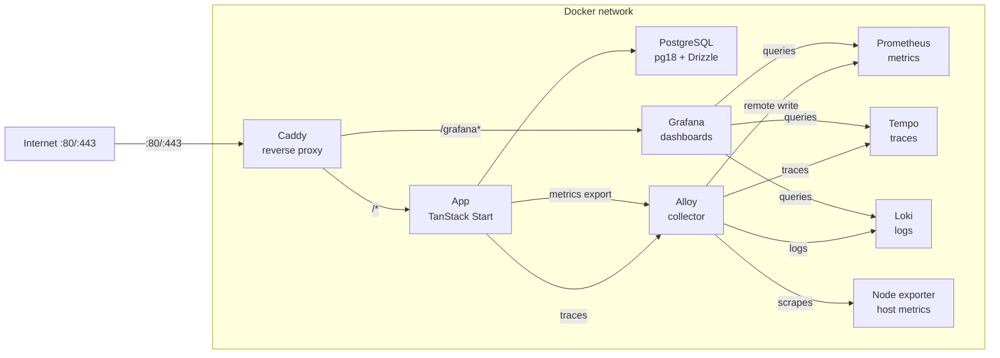

# Snack Rating App

## Why I created this project?

This project was built as an exercise in doing things “properly” from end to end. The main goal was to learn how to integrate a full observability stack and design a production-like development experience. After seeing many poorly built production applications, I decided to create this repository as an example of a cleaner and more maintainable approach.

The second goal was to build something people could actually use on a daily basis. When a new energy drink or snack comes out, users can quickly check ratings and decide whether it’s worth buying.

## Prerequisites

- Node.js 26
- pnpm
- Docker + Docker Compose

## Quick start — development

```bash
cp .env.example .env.development
pnpm install
pnpm infra:up
pnpm db:migrate && pnpm db:seed
pnpm dev # → http://localhost:3000/
```

## Tech stack

UI:

- React
- TanStack Start
- Tailwind CSS
- shadcn

API:

- oRPC
- TanStack Start API Routes

Database:

- PostgreSQL 18
- Drizzle ORM

Observability:

- Grafana Alloy — metrics/logs/traces collection
- Prometheus — metrics backend (remote write)
- Grafana — dashboards & alerting
- Tempo — distributed tracing
- Loki — log aggregation

Storage:

- Garage — S3-compatible object storage for app uploads and bucket hosting

## Environment variables

Copy the appropriate example file and fill in values before running anything.

| Variable                         | Used in    | Description                               |
| -------------------------------- | ---------- | ----------------------------------------- |
| `POSTGRES_USER`                  | dev + prod | Database user                             |
| `POSTGRES_PASSWORD`              | dev + prod | Database password                         |
| `POSTGRES_DB`                    | dev + prod | Database name                             |
| `APP_DOMAIN`                     | prod       | Domain for Caddy TLS (e.g. `example.com`) |
| `GRAFANA_INITIAL_ADMIN_USER`     | dev + prod | Initial grafana username                  |
| `GRAFANA_INITIAL_ADMIN_PASSWORD` | dev + prod | Initial grafana password                  |
| `GRAFANA_SMTP`                   | prod       | SMTP host for Grafana alerts              |
| `GRAFANA_SMTP_USER`              | prod       | SMTP username                             |
| `GRAFANA_SMTP_PASSWORD`          | prod       | SMTP password                             |
| `GRAFANA_SMTP_FROM_ADDRESS`      | prod       | From address for alert emails             |
| `GARAGE_RPC_SECRET`              | dev + prod | Cluster RPC secret                        |
| `GARAGE_ADMIN_TOKEN`             | dev + prod | Garage admin API token                    |
| `GARAGE_METRICS_TOKEN`           | dev + prod | Garage metrics endpoint token             |
| `GARAGE_DEFAULT_ACCESS_KEY`      | dev + prod | Default S3 access key                     |
| `GARAGE_DEFAULT_SECRET_KEY`      | dev + prod | Default S3 secret key                     |
| `GARAGE_DEFAULT_BUCKET`          | dev + prod | Default bucket created on startup         |

> [!IMPORTANT]
> `GRAFANA_INITIAL_*` variables only work on a fresh Grafana volume. Changes made after Grafana has been initialized will not be applied. Use `grafana-cli` instead.

Dev: `.env.development` - Prod: `.env.production`

## Database

### Migrations

```bash
pnpm db:generate   # generate migration files from schema changes
pnpm db:migrate    # apply pending migrations
```

### Seeding

```bash
pnpm db:seed
```

Runs `./drizzle/scripts/seed.ts` - feel free to edit it for your own purposes.

### Resetting

```bash
# Soft reset — clears data, keeps tables
pnpm db:reset

# Hard reset — removes everything including volumes
docker compose down && docker volume rm snack-rate_postgres_data
```

### Schema diagram

See `./drizzle/docs/db-diagram.dbml`.

## Running — development

```bash
pnpm infra:up   # starts garage, postgres, grafana, prometheus, alloy, tempo, loki
pnpm dev        # starts app → http://localhost:3000/
```

> [!NOTE]
> Garage runs in a container with persistent volumes. Its S3 API is exposed on `http://localhost:3900`, the web endpoint on `http://localhost:3902`, and the admin API on `http://localhost:3903`.

## Running — production

```bash
docker network create snack-rate-edge
pnpm proxy:up
pnpm prod:up
```

Starts the app stack for production. The shared Caddy proxy runs separately and serves both prod and staging.

### Services & URLs (production)

| Service    | URL                           | Notes               |
| ---------- | ----------------------------- | ------------------- |
| App        | `http(s)://localhost/`        | Proxied by Caddy    |
| Garage S3  | `http://localhost:3900`       | S3 API endpoint     |
| Garage web | `http://localhost:3902`       | Bucket website host |
| Grafana    | `http(s)://localhost/grafana` | Dashboards & alerts |
| Prometheus | internal only                 | Metrics backend     |
| Alloy      | internal only                 | Collector           |
| Tempo      | internal only                 | Traces              |
| Loki       | internal only                 | Logs                |

Caddy handles TLS automatically when `APP_DOMAIN` is set to a real domain. It also strips the `/grafana` prefix before forwarding to the Grafana container.

### Running database scripts in staging/prod

The staging and production compose overlays now include a one-off `db-tool` service that uses the build stage of the app image, so it has `drizzle-kit`, the source tree, and the correct `.env` file.

```bash
pnpm staging:db:migrate
pnpm staging:db:seed
pnpm prod:db:migrate
```

To run a different script, override the compose command, for example:

```bash
docker compose --profile tools -p snack-rate-staging -f compose.yml -f compose.staging.yml --env-file .env.staging run --rm db-tool run db:seed
```

## Running — staging

```bash
# You need to create this network once.
docker network create snack-rate-edge
pnpm proxy:up
pnpm staging:up
```

Starts the staging app stack. The shared Caddy proxy must already be running and `.env.caddy` must define both hostnames.

Copy `.env.example` to `.env.staging` first and copy [.env.caddy.example](/home/maciek/snack-rate/.env.caddy.example) to `.env.caddy` for the shared proxy.
Set `STAGING_BASIC_AUTH_USER` and `STAGING_BASIC_AUTH_HASH` in `.env.caddy`; use `pnpm proxy:generate-hash yourpassword` to generate the hash.

### Infrastructure diagram - production



## Formatting & linting

```bash
pnpm fmt
pnpm lint
```

## File naming

I used kebab-case for files. Some files have .server.ts end, because of [TanStack Start behaviour](https://tanstack.com/start/latest/docs/framework/react/guide/import-protection#default-rules).
