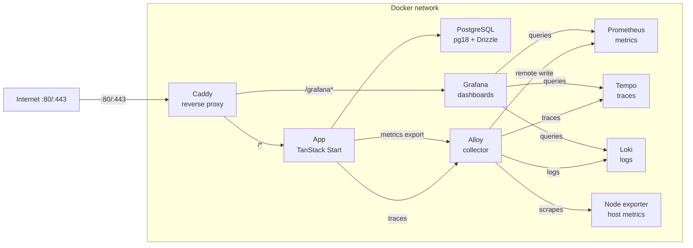

# Snack Rating App

## Why I created this project?

This project was built as an exercise in doing things “properly” from end to end. The main goal was to learn how to integrate a full observability stack and design a production-like development experience. After seeing many poorly built production applications, I decided to create this repository as an example of a cleaner and more maintainable approach.

The second goal was to build something people could actually use on a daily basis. When a new energy drink or snack comes out, users can quickly check ratings and decide whether it’s worth buying.

## Prerequisites

- Node.js 26
- pnpm
- Docker + Docker Compose

## Quick start — development

```bash
cp .env.example .env.development
pnpm install
pnpm infra:up
pnpm db:migrate && pnpm db:seed
pnpm dev # → http://localhost:3000/  (or whatever APP_PORT is set to)
```

## Tech stack

UI:

- React
- TanStack Start
- Tailwind CSS
- shadcn

API:

- oRPC
- TanStack Start API Routes

Database:

- PostgreSQL 18
- Drizzle ORM

Observability:

- Grafana Alloy — metrics/logs/traces collection
- Prometheus — metrics backend (remote write)
- Grafana — dashboards & alerting
- Tempo — distributed tracing
- Loki — log aggregation

Storage:

- Garage — S3-compatible object storage for app uploads and bucket hosting

## Environment variables

Copy the appropriate example file and fill in values before running anything.

### Application

| Variable     | Used in    | Description                                       |
| ------------ | ---------- | ------------------------------------------------- |
| `APP_PORT`   | dev + prod | Application port (default 3000)                   |
| `NODE_ENV`   | dev + prod | Runtime environment (`development`, `production`) |
| `APP_DOMAIN` | prod       | Domain for Caddy TLS (e.g. `example.com`)         |

### Database

| Variable            | Used in    | Description                  |
| ------------------- | ---------- | ---------------------------- |
| `POSTGRES_USER`     | dev + prod | Database user                |
| `POSTGRES_PASSWORD` | dev + prod | Database password            |
| `POSTGRES_DB`       | dev + prod | Database name                |
| `DATABASE_URL`      | dev + prod | PostgreSQL connection string |

### S3 / Storage

| Variable               | Used in    | Description                                 |
| ---------------------- | ---------- | ------------------------------------------- |
| `S3_ENDPOINT_INTERNAL` | dev + prod | S3 endpoint used from inside Docker network |
| `S3_ACCESS_KEY`        | dev + prod | Default S3 access key                       |
| `S3_SECRET_KEY`        | dev + prod | Default S3 secret key                       |
| `S3_ENDPOINT`          | dev + prod | S3-compatible endpoint (e.g. Garage)        |
| `S3_REGION`            | dev + prod | S3 region (e.g. `garage`)                   |
| `S3_BUCKET_UPLOADS`    | dev + prod | Bucket for uploaded files                   |
| `S3_BUCKET_PUBLIC`     | dev + prod | Bucket for public assets                    |

### Garage

| Variable               | Used in    | Description                   |
| ---------------------- | ---------- | ----------------------------- |
| `GARAGE_RPC_SECRET`    | dev + prod | Cluster RPC secret            |
| `GARAGE_ADMIN_TOKEN`   | dev + prod | Garage admin API token        |
| `GARAGE_METRICS_TOKEN` | dev + prod | Garage metrics endpoint token |

### Observability

| Variable                        | Used in    | Description                      |
| ------------------------------- | ---------- | -------------------------------- |
| `OTEL_EXPORTER_OTLP_ENDPOINT`   | dev + prod | OpenTelemetry collector endpoint |
| `OBSERVABILITY_LOG_LEVEL`       | dev + prod | Log level (e.g. debug, info)     |
| `OBSERVABILITY_METRICS_ENABLED` | dev + prod | Enable metrics collection        |
| `OBSERVABILITY_TRACING_ENABLED` | dev + prod | Enable distributed tracing       |

### Grafana

| Variable                    | Used in    | Description                         |
| --------------------------- | ---------- | ----------------------------------- |
| `GF_DOMAIN`                 | prod       | Grafana domain (`GF_SERVER_DOMAIN`) |
| `GF_SERVER_ROOT_URL`        | prod       | Grafana root URL                    |
| `GF_INITIAL_ADMIN_USER`     | dev + prod | Initial Grafana username            |
| `GF_INITIAL_ADMIN_PASSWORD` | dev + prod | Initial Grafana password            |
| `GF_SMTP`                   | prod       | SMTP host for Grafana alerts        |
| `GF_SMTP_USER`              | prod       | SMTP username                       |
| `GF_SMTP_PASSWORD`          | prod       | SMTP password                       |
| `GF_SMTP_FROM_ADDRESS`      | prod       | From address for alert emails       |

> [!IMPORTANT]
> `GF_INITIAL_*` variables only work on a fresh Grafana volume. Changes made after Grafana has been initialized will not be applied. Use `grafana-cli` instead.

| File               | Used for          |
| ------------------ | ----------------- |
| `.env.development` | Local development |
| `.env.production`  | Production stack  |
| `.env.staging`     | Staging stack     |

## Database

### Migrations

```bash
pnpm db:generate          # generate migration files from schema changes
pnpm db:migrate           # apply pending migrations to local dev DB
pnpm db:push              # push schema directly (dev only)
pnpm db:pull              # pull schema from DB
```

### Seeding

```bash
pnpm db:seed               # seed local dev DB
pnpm db:seed-prod          # seed prod/staging DB (runs directly, no Docker)
```

Runs the script in `./drizzle/scripts/`. Edit them for your own purposes.

### Resetting

```bash
# Soft reset — clears data, keeps tables
pnpm db:reset

# Hard reset — removes everything including volumes
docker compose down && docker volume rm snack-rate_postgres_data
```

### Running database scripts in staging/prod

The staging and production compose overlays include a one-off `db-tool` service that uses the build stage of the app image.

```bash
pnpm db:migrate-and-seed-prod      # migrate + seed production
pnpm db:migrate-and-seed-staging   # migrate + seed staging
```

To run a different script, override the compose command:

```bash
docker compose -p snack-rate-staging -f compose.yml -f compose.staging.yml --env-file .env.staging run --rm db-tool pnpm db:seed-prod
```

### Schema diagram

See `./drizzle/docs/db-diagram.dbml`.

## Running — development

```bash
pnpm infra:up   # starts garage, postgres, grafana, prometheus, alloy, tempo, loki
pnpm dev        # starts app — port from APP_PORT env (default 3000)
```

> [!NOTE]
> Garage runs in a container with persistent volumes. Its S3 API is exposed on `http://localhost:3900`, the web endpoint on `http://localhost:3902`, and the admin API on `http://localhost:3903`.

## Running — production

Each environment is self-contained with its own Caddy reverse proxy. No shared networks or services between stacks.

```bash
pnpm prod:up
```

### Services & URLs (production)

| Service    | URL                           | Notes               |
| ---------- | ----------------------------- | ------------------- |
| App        | `http(s)://localhost/`        | Proxied by Caddy    |
| Garage S3  | `http://localhost:3900`       | S3 API endpoint     |
| Garage web | `http://localhost:3902`       | Bucket website host |
| Grafana    | `http(s)://localhost/grafana` | Dashboards & alerts |
| Prometheus | internal only                 | Metrics backend     |
| Alloy      | internal only                 | Collector           |
| Tempo      | internal only                 | Traces              |
| Loki       | internal only                 | Logs                |

Caddy handles TLS automatically when `APP_DOMAIN` is set to a real domain. It also strips the `/grafana` prefix before forwarding to the Grafana container.

## Running — staging

```bash
pnpm staging:up
```

Copy `.env.example` to `.env.staging` first. Use `pnpm hash-password yourpassword` to generate the bcrypt hash for `STAGING_BASIC_AUTH_HASH`.

### Infrastructure diagram - production



## Formatting & linting

```bash
pnpm fmt
pnpm lint
```

## File naming

I used kebab-case for files. Some files have .server.ts end, because of [TanStack Start behaviour](https://tanstack.com/start/latest/docs/framework/react/guide/import-protection#default-rules).
