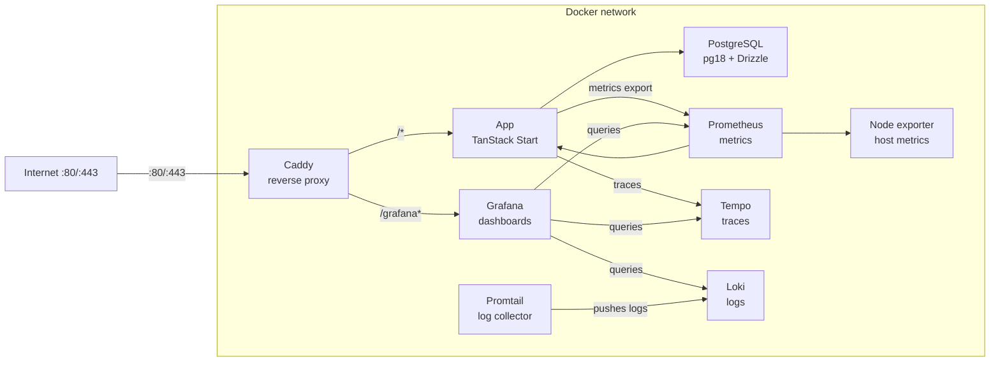

# Snack Rating App

Not hosted anywhere for now.

## Prerequisites

- Node.js 26
- pnpm
- Docker + Docker Compose

## Quick start — development

```bash
cp .env.example .env.development
pnpm install
pnpm infra:up
pnpm db:migrate && pnpm db:seed
pnpm dev # → http://localhost:3000/
```

## Tech stack

UI:

- React
- TanStack Start
- Tailwind CSS
- shadcn

API:

- oRPC
- TanStack Start API Routes

Database:

- PostgreSQL 18
- Drizzle ORM

Observability:

- Prometheus — metrics collection
- Grafana — dashboards & alerting
- Tempo — distributed tracing
- Loki + Promtail — log aggregation

## Environment variables

Copy the appropriate example file and fill in values before running anything.

| Variable                    | Used in    | Description                               |
| --------------------------- | ---------- | ----------------------------------------- |
| `POSTGRES_USER`             | dev + prod | Database user                             |
| `POSTGRES_PASSWORD`         | dev + prod | Database password                         |
| `POSTGRES_DB`               | dev + prod | Database name                             |
| `APP_DOMAIN`                | prod       | Domain for Caddy TLS (e.g. `example.com`) |
| `GRAFANA_SMTP`              | prod       | SMTP host for Grafana alerts              |
| `GRAFANA_SMTP_USER`         | prod       | SMTP username                             |
| `GRAFANA_SMTP_PASSWORD`     | prod       | SMTP password                             |
| `GRAFANA_SMTP_FROM_ADDRESS` | prod       | From address for alert emails             |

Dev: `.env.development` - Prod: `.env.production`

## Database

### Migrations

```bash
pnpm db:generate   # generate migration files from schema changes
pnpm db:migrate    # apply pending migrations
```

### Seeding

```bash
pnpm db:seed
```

Runs `./drizzle/scripts/seed.ts` - feel free to edit it for your own purposes.

### Resetting

```bash
# Soft reset — clears data, keeps tables
pnpm db:reset

# Hard reset — removes everything including volumes
docker compose down && docker volume rm snack-rate_postgres_data
```

### Schema diagram

See `./drizzle/docs/db-diagram.dbml`.

## Running — development

```bash
pnpm infra:up   # starts postgres, grafana, prometheus, tempo, loki
pnpm dev        # starts app → http://localhost:3000/
```

## Running — production

```bash
pnpm prod:up
```

Starts the full stack including the app container and Caddy reverse proxy.

### Services & URLs (production)

| Service    | URL                           | Notes               |
| ---------- | ----------------------------- | ------------------- |
| App        | `http(s)://localhost/`        | Proxied by Caddy    |
| Grafana    | `http(s)://localhost/grafana` | Dashboards & alerts |
| Prometheus | internal only                 | Metrics scraping    |
| Tempo      | internal only                 | Traces              |
| Loki       | internal only                 | Logs                |

Caddy handles TLS automatically when `APP_DOMAIN` is set to a real domain. It also strips the `/grafana` prefix before forwarding to the Grafana container.

### Infrastructure diagram - production



## Formatting & linting

```bash
pnpm fmt
pnpm lint
```
